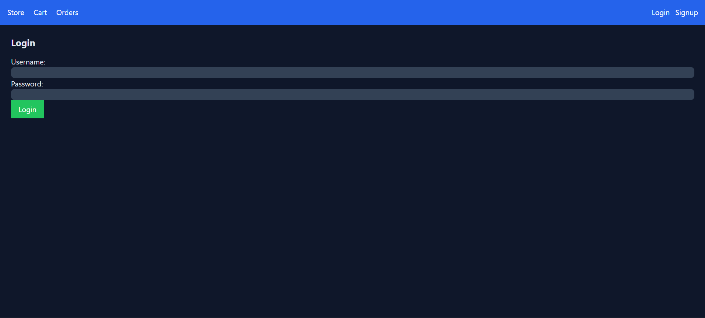
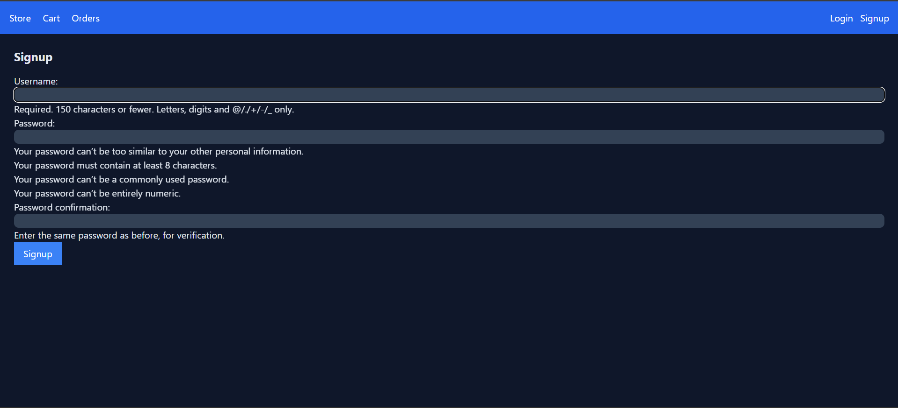
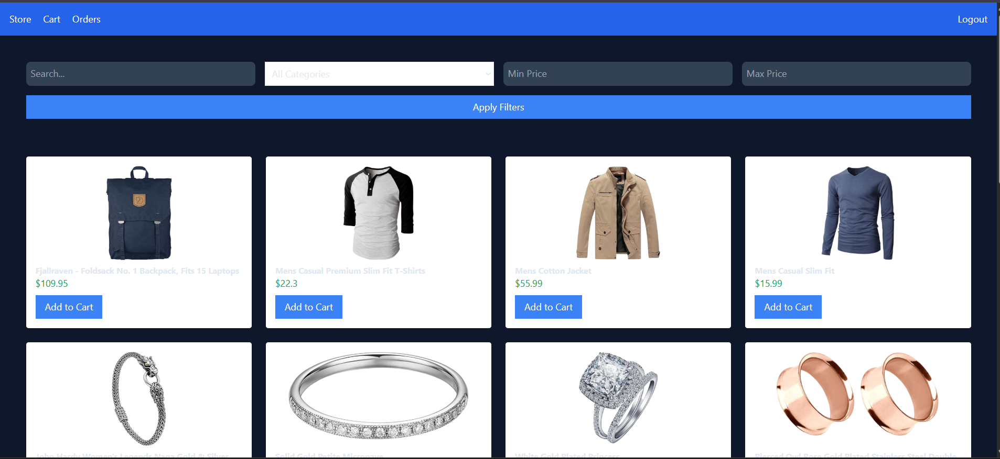
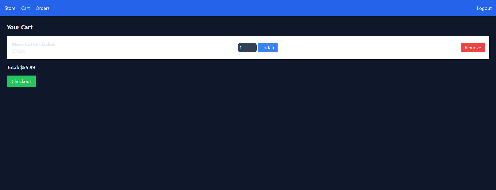
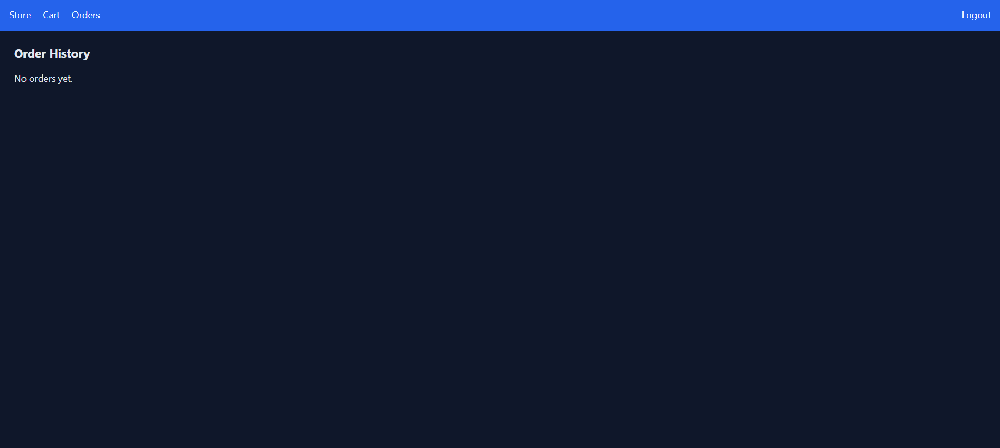

# 🚀 Django E-Commerce Platform (API Integrated) 
<p align="center"> 
   
   
   
   
   
</p> 

---

## ✨ Features
- Authentication
- User Signup & Login
- Secure authentication system
- Persistent user sessions

## 🛍️ Product System
- Products fetched from FakeStoreAPI
- Search functionality
- Category filtering
- Price filtering

## 🛒 Cart System
- Add to cart
- Update quantity
- Remove items
- Persistent cart per user
  
## 💳 Payment Integration
- Stripe Checkout (Test Mode)
- Secure payment flow
- Order creation after successful payment
  
## 📦 Order Management
- Order history per user
- Order tracking

## Admin Dashboard
- Custom admin panel (separate from Django admin)
- Manage users, orders, products
- View sales overview

---

## 🧠 Tech Stack
| Category | Technology |
|----------|-----------|
| Django | Backend Framework |
| Python | Core Language |
| Tailwind | CSS Styling |
| Stripe API | Payments |
| FakeStoreAPI | Product Data |
| SQLite | Database |

---

## 📂 Project Structure 
```
ecommerce/
│
├── ecommerce/
│   ├── __init__.py
│   ├── settings.py
│   ├── urls.py
│   ├── asgi.py
│   └── wsgi.py
│
├── store/
│   ├── migrations/
│   ├── templates/store/
│   │   ├── base.html
│   │   ├── home.html
│   │   ├── cart.html
│   │   ├── login.html
│   │   ├── signup.html
│   │   ├── orders.html
│   │   ├── success.html
│   │
│   ├── __init__.py
│   ├── models.py
│   ├── views.py
│   ├── urls.py
│   └── admin.py
│
├── dashboard/
│   ├── templates/dashboard/
│   │   ├── home.html
│   │   ├── users.html
│   │   ├── orders.html
│   │   ├── products.html
│   │   └── add_product.html
│   │
│   ├── __init__.py
│   ├── views.py
│   ├── urls.py
│
├── manage.py
```

---

## ⚙️ Installation & Setup
### 1. Clone Repository 
```bash 
git clone https://github.com/yourusername/ecommerce.git
cd ecommerce
```
### 2. Create Virtual Environment 
```
python -m venv venv
venv\Scripts\activate
```
### 3. Install Dependencies 
```
pip install -r requirements.txt
```
### 4. Stripe Import 
```
pip install stripe
```
### 5. Apply Migrations 
```
python manage.py migrate
```
### 6. Create Superuser 
```
python manage.py createsuperuser
```
### 7. Run server 
```
python manage.py runserver
```

---

8. ### Location for API Keys
- Backend (`store/views.py`)	✅ sk_test_...
- Frontend (`Store/templates/store/cart.html`)	✅ pk_test_...

---

9. ## 🔑 Environment Variables
Create a `.env` file:
```
STRIPE_SECRET_KEY=sk_test_...
STRIPE_PUBLIC_KEY=pk_test_...
```

---

## 🔗 Important URLs
| Page | URL |
|----------|-----------|
| Home | `/` |
| Cart | `/cart/` |
| Orders | `/orders/` |
| Login | `/login/` |
| Signup | 	`/signup/` |
| Django Admin | `/admin/` |
| Custom Dashboard | `/admin-dashboard/` |

---

## 🖼️ Interface Preview
<p align="center">
  
  
  
  
  
</p>


---


## 🚀 Future Improvements
- Product detail page
- Reviews & ratings
- AJAX cart (no reload)
- Email notifications
- Deployment (AWS / Railway / Vercel)

---

## 🤝 Contributing
Pull requests are welcome. For major changes, please open an issue first.

---

## 📜 License
This project is licensed under the MIT License.

---

## 👨‍💻 Author
**Md Aziz**  
Built under **NexVerix** — focusing on practical and real-world development. <br>
GitHub: https://github.com/NexVerix   
	

	
	
